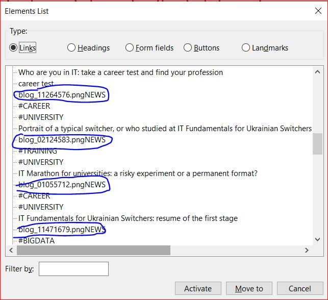

<h1>Homework</h1>

<h2>Three-stars task ⭐ ⭐ ⭐</h2>
##Work with Audit tools

1. Open training.epam.com in Google Chrome and check the page using the Accessibility Audit in the dev tools

  
  

Issues:

- [aria-*] attributes do not match their roles
- Buttons do not have an accessible name
- Form elements do not have associated labels
- Links do not have a discernible name (element does not have text that is visible to screen readers)
- Background and foreground colors do not have a sufficient contrast ratio.
- Lists do not contain only <li> elements and script supporting elements.

2. Install the Siteimprove plugin in Google Chrome
Audit the training.epam.com page in Siteimprove plugin (Uncheck the Editor filter)я

  
  

Issues:

- Page zoom is restricted  
1.4.4 Resize text
1.4.10 Reflow

- Container element is empty  
1.3.1 Info and Relationships

- Color contrast is not sufficient  
1.4.3 Contrast (Minimum)
1.4.6 Contrast (Enhanced)

3. Install the WAVE plugin in Google Chrome. 
Audit the training.epam.com page in WAVE plugin

  

Issues:

- Missing form label
- Empty form label
- Empty heading
- Empty button
- Empty link
- Broken ARIA menu
- Contrast Errors
- Select missing label
- Redundant alternative text
- Suspicious alternative text
- Broken same-page link
- Redundant link
- Very small text

4. I’ve checked additionally by Axe tool:

  
  

5. In your homework report, provide a list of all the NOT met Success Criteria found by the three auditing tools. For each analysis, provide data in the format:
- Report screenshots,
- List of errors found

Done (please see above).

6.	Are there any Success Criteria that you think are misidentified by the audit tools? Why do you think so?
-	Contrast 1.4.6 (Enhanced) by Siteimprove plugin is the requirement for AAA level, but we only need AA level requirements

- Redundant alternative text by WAVE plugin:
      Alt text is good enough

- Broken same-page link text by WAVE plugin:
      Links works in a proper way

- Redundant link by WAVE plugin:
      Links works in a proper way

<h2>Four-stars task ⭐ ⭐ ⭐ ⭐</h2>
Work with NVDA (Windows) or with VoiceOver (Mac)
1.	Install NVDA https://www.nvaccess.org/download/ for Windows or use Voice Over on Mac
2.	Launch the Speech Viewer window
3.	Open page training.epam.com and an Elements list. Insert + F7 for NVDA.
4.	Explore all categories of navigation elements
- links,
- headings,
- form elements,
- buttons,
- landmarks

5.	Provide elements with a11y issues in the following format:
      •	Name of the navigation element with a screenshot of the opened Elements list window
      •	The problems you have identified Additionally, you can list the Success Criteria that are not met because of these issues.

THERE ARE A11TY ISSUES REGARDING LINKS:

  

- Link text must describe the link target. When the accessible name of a link does not describe its target or purpose, users will not have the information they need to determine the usefulness of the target resources.
  WCAG Success Criteria: 2.4.4 Link Purpose (In Context) (Level A, Primary Success Criterion)

THERE ARE A11TY ISSUES REGARDING HEADINGS:

  

- h1 must match part of the title
WCAG Success Criteria
2.4.2 Page Titled (Level A, Primary Success Criterion)

- Consistent h1 and h2 page section labels
WCAG Success Criteria
3.2.4 Consistent Identification (Level AA, Primary Success Criterion)

- Consistent ordering of h1 and h2 labels
WCAG Success Criteria
3.2.3 Consistent Navigation (Level AA, Primary Success Criterion)

- Page must have h1 element
WCAG Success Criteria
2.4.1 Bypass Blocks (Level A, Primary Success Criterion)

- h1 must be in main or banner landmark
WCAG Success Criteria
2.4.6 Headings and Labels (Level AA, Primary Success Criterion)

- Headings must be properly nested
WCAG Success Criteria
1.3.1 Info and Relationships (Level A, Primary Success Criterion)

  
THERE ARE A11TY ISSUES REGARDING FORMS:

  

- Missing form label. Empty form label. Form controls must have labels
WCAG Success Criteria
3.3.2 Labels or Instructions (Level A, Primary Success Criterion)

THERE ARE A11TY ISSUES REGARDING BUTTONS:

  

- button elements must have text content.
  WCAG Success Criteria
  3.3.2 Labels or Instructions (Level A, Primary Success Criterion)

THERE ARE A11TY ISSUES REGARDING LANDMARKS:

  

- All content must be contained in landmarks
WCAG Success Criteria
1.3.1 Info and Relationships (Level A, Primary Success Criterion)

- main landmark: at least one
  WCAG Success Criteria
  2.4.1 Bypass Blocks (Level A, Primary Success Criterion)

<h2>Five-stars task ⭐ ⭐ ⭐ ⭐ ⭐</h2>
Work with contrast
1.	Audit the page contrast at training.epam.com using each of the following tools:
      •	Color contrast analyzer,
      •	Siteimprove

2.	Provide the list of the contrast issues in the following format:
      •	Name of the tool,
      •	Screenshot of the report after analysis,
      •	Found contrast issues

Color contrast analyzer

  

-Text content must exceed Color Contrast Ratio (CCR) of 3.1 for large and/or bolded text and 4.5 for any other size or style of text (PLEASE SEE SCREENSHOT ABOVE).
WCAG Success Criteria
1.4.3 Contrast (Minimum) (Level AA, Primary Success Criterion)

Siteimprove

  

There are 232 cases, there`s 1 example:

Issue Description
Ensures the contrast between foreground and background colors meets WCAG 2 AA contrast ratio thresholds
Element Location
.nav-container[ng-show="isAnonymousUser"] > .nav-list__item[href$="/#!/TrainingList"][ng-repeat="basicRoute in basicRoutes"]
Element Source
<a ng-repeat="basicRoute in basicRoutes" class="nav-list__item ng-binding ng-scope" href="/#!/TrainingList" route-link-active="">
Training list
</a>
To solve this problem, you need to...
Fix the following:
Element has insufficient color contrast of 1.82 (foreground color: #ffffff, background color: #76cdd8, font size: 10.9pt (14.5px), font weight: bold). Expected contrast ratio of 4.5:1
Related Node
<header id="header" current-language="EN" class="ng-isolate-scope">

And I`ve checked by AQA tool additionally:

  

